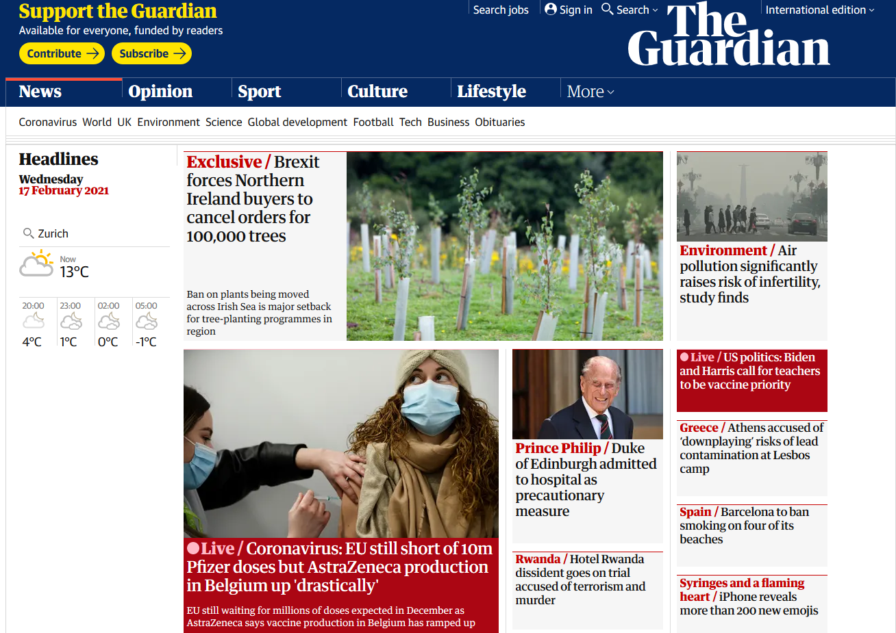
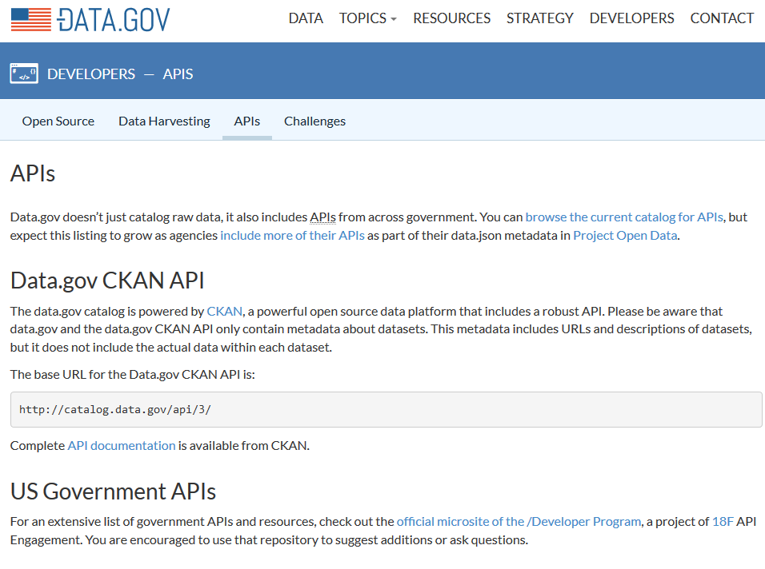
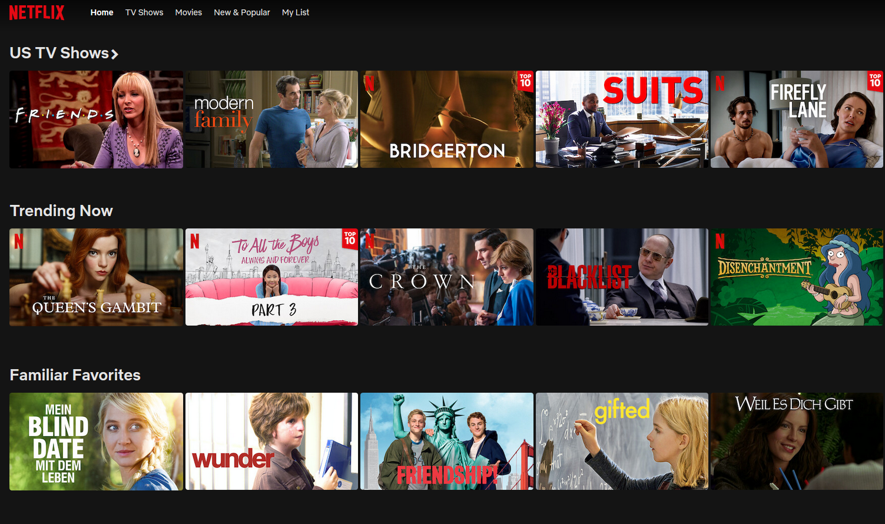
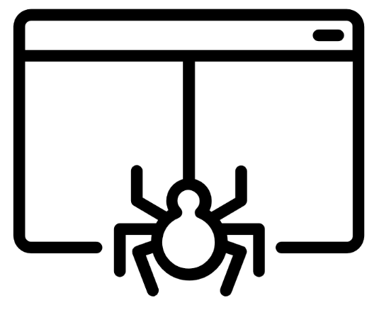

layout: true

<div class="my-footer">
  <span style="text-align:center">
    <span>
      
    </span>
      <a href = "https://github.com/ibantel/2021-03-05_CEU_Webscraping-with-R">
        <span style="padding-left:82px">
          <font color="#7E7E7E">Ivo Bantel (UZH / CIS)</font>
        </span>
        <font color="#7E7E7E">Collecting web data with R | March 5, 2021</font>
      </a>
</div> 


---


```{r setup, include=FALSE}
options(htmltools.dir.version = FALSE)
# see: https://github.com/yihui/xaringan
# install.packages("xaringan")
# see: 
# https://github.com/yihui/xaringan/wiki
# https://github.com/gnab/remark/wiki/Markdown
options(width=110)
options(digits = 4)
```

```{r setup (2), echo = FALSE ,message = FALSE, warning = FALSE}
knitr::opts_chunk$set(comment=NA, fig.width=6, fig.height=6, echo = TRUE, eval = TRUE, message = FALSE, warning = FALSE, fig.align = 'center', dpi = 200)
library(tidyverse)
```


# Welcome & overview

## Plan of the course

<!--- - if you have not, **install packages!!!** --->
.pull-left55[
<ul>
  <li class="m1">Introduction</li><br>
  
  <li class="m1">Background scraping</li>
  <ul class="level">
    <li><span>why you should (not) scrape</span></li>
    <li><span>varieties of scraping</span></li>
    <li><span>HTML</span></li>
  </ul><br><br>

  <li class="m2">Hands-on</li>
  <ul class="level">
    <li><span>scraping tables</span></li>
    <li><span>extraction using CSS selectors</span></li>
    <li><span>scaling up: scraping several pages <!--- with loops and functions ---></span></li>
  </ul><br><br>
  
  <li class="m3">Outlook: overview of other techniques <!--- (RSS, APIs, Selenium, social media data) ---></li>
  
</ul>


]

.pull-right35[

<br><br><br><br>
<!---  ADD TIME VISUALIZATION | OR: package installations --->

]

???

- I will give overview of course

- Please turn on cameras :)

- We will have a hands-on section in the end -- you will be in smaller breakout rooms to help each other where you can


**TO DO**: allocate times

---
class: inverse, center, middle

# Introduction(s)

???

To get started I want to introduce myself and get to know your backgrounds a tiny little bit better

---

# Introduction (1)

.pull-left55[

## About me: Ivo Bantel
<br><br>
<ul>
  <li class="m1">PhD student (UZH, Digital Democracy Lab)</li><br>
  <li class="m2">_research interests_:</li>
    &#8239; &#8239; &#8239; &#8239; polarization, extreme right politics, political violence<br><br>
  <!--- <li class="m2">_teaching_: webscraping, qualitative methods, substantive courses</li><br>--->
  <li class="m2">_contact_:</li>
  &#8239; &#8239; &#8239; &#8239;
  <i class='fas fa-envelope' style='font-size:.9em;' ></i> &#8239; &#8239; &#8239; [bantel@ipz.uzh.ch](mailto:bantel@ipz.uzh.ch)
  <br> &#8239; &#8239; &#8239; &#8239;
  <i class='fab fa-twitter' style='font-size: .9em;'></i> &#8239; &#8239; &#8239; [@ivobantel](https://twitter.com/ivobantel) 
  <br>
<ul>
]

.pull-right25[
<a href='https://www.ipz.uzh.ch/en'> <br>
<a href='https://www.ipz.uzh.ch/en'>

<!--- https://fontmeme.com/name-tags/ --->

]

???
I will introduce myself quickly

Due to the limited time, we won't be able to go around for everyone to introduce themselves unfortunately. So I will have to get to know you quantitatively - sorry for that! If you want to stick around for a drink later on, I'd be happy to chat for a bit.

But for now, I have some questions. Please use *Yes*, *No* etc. in Zoom.
---

# Introduction (2)

## Getting to know you

- How much experience do you have in R? <br> 
  &nbsp;  &nbsp; None &nbsp;  &nbsp;  &nbsp;
  &nbsp;  &nbsp; Some  &nbsp;  &nbsp;  &nbsp;
  &nbsp;  &nbsp; I can write functions &nbsp;  &nbsp;  &nbsp;
  &nbsp;  &nbsp; I'm a pro

--
 

<br>

- Have you ever webscraped? <br>
  &nbsp;  &nbsp; What _is_ that? &nbsp; &nbsp;
  &nbsp;                  &nbsp; Never           &nbsp; &nbsp;
  &nbsp;                &nbsp; Once            &nbsp; &nbsp;
  &nbsp;            &nbsp; I could teach it

--
 

<br>

- How comfortable are you with HTML? <br>
  &nbsp;  &nbsp; HTwhat? &nbsp; &nbsp; &nbsp;
  &nbsp;                  &nbsp; Heard of it    &nbsp; &nbsp;
  &nbsp;                &nbsp; I know basics  &nbsp; &nbsp;
  &nbsp;            &nbsp; I'm fluent


<br>


<!--- - Is there a specific webpage you want to scrape? (Use chat) --->

---
class: inverse, center, middle

# Background scraping


???

let's get started with the content then

I will first give some background for everyone to understand how we can leverage `R` to automatically collect data from the web

---

# Scraping &mdash; and why you...
<br>

.pull-left45[
### &nbsp; &nbsp; &nbsp; ...should **not** do it

<br> 
#### Legal, ethical, and logistical barriers

- criminal code, copyright laws etc.
- terms of service
- ethical regulations (privacy, GDPR, informed consent)
- measures to prevent scraping (API restrictions, 'distributed Turing test')

]

--

.pull-right45[
### &nbsp; &nbsp; &nbsp; ... should do it
<br> 
#### Data availability
- increasing amount of public data online ('open government')
- increasing amount of politics happens online
- increasing amount of people use the internet
- we share everything online
- that makes real world phenomena more visible online 
]

???

We can only touch upon the legal and ethical questions here. But be aware that you need to take this into account!

---

# Scraping: what is out there?

--

.pull-left45[

<br><b><font size=6 color = "A0A0A0">1. Scraping static pages</font></b></li>

]

.pull-right45[

  <a href = "https://www.theguardian.com/international">
    
  </a>
  <font size=1>Screenshot "The Guardian"</font>

]

???

- Scraping: extracting data from the web
 - includes anything from university webpage to social media
 - lots of different techniques

- types of scraping
 - structured vs. unstructured data
 - gathering as diverse information as possible from different pages vs. very specific scrapers
 - one-off scraping vs. regular data collection


1. Static pages (that is what we'll cover today)
- extracting text, links and tables from many standard webpages
    - page written in HTML / XML
    - page has a static URL through which you can reach it

Procedure
- 'parsing' page in R
- extracting relevant parts
- cleaning into usable format (e.g. data frame, raw text, ...)

---

# Scraping: what is out there? (2)


.pull-left45[

<br><b><font size=6 color = "A0A0A0">1. Scraping static pages</font></b></li>
<br><br><br><br><font size=6 color = "A0A0A0">2. APIs <font size=4>(application programming interface)</font></font></li>

]

.pull-right45[

  <a href = "https://www.data.gov/developers/apis">
    
  </a>
  <font size=1>Screenshot "DATA.GOV"</font>

]


???

2. APIs

- companies and governments often provide **application programming interfaces** for their data
    - increasing accessibility, reliability
    - used for scraping and interaction with apps

- Differences to static pages
  - structured data in specific notation (often JSON)
  - access through sending requests, e.g. with `httr` package
  - in many cases: R packages for access to API, e.g. `gender`, `rtweet`, `WikipediR`, `tuber`, ...

- pro: 1) legal and robust to changes in webpage structure; 2) highly standardized
- con: 1) availability: not every page has API; 2) speed: rate limits / restrictions to amount of data; 3) may be terminated: ['post API age'](https://www.tandfonline.com/doi/full/10.1080/10584609.2018.1477506) 

---

# Scraping: what is out there? (3)


.pull-left45[

<br><b><font size=6 color = "A0A0A0">1. Scraping static pages</font></b></li>
<br><br><br><br><font size=6 color = "A0A0A0">2. APIs <font size=4>(application programming interface)</font></font></li>
<br><br><br><br><font size=6 color = "000000">3. Dynamic pages</font></li>

]

.pull-right45[

  <br><br><br>
    
  <br>
  <font size=1>Screenshot "Netflix.com"</font>

]


???

3. dynamic pages
- for scraping pages that change while you are on them without changing their URL
    - e.g. Netflix, Buzzfeed, (many) search functions, pages without permanent URL

- Differences to static pages
  - simulates web browsing rather than parsing static page
  - scraping through commands to browser

- pro
    - get around many restrictions to scraping
    - possibility to automate browsing
- con
    - difficult to set up
    - less robust than static scraping
    - legal concerns

---

# Scraping: what is out there? (4)


.pull-left45[

<br><b><font size=6 color = "A0A0A0">1. Scraping static pages</font></b>
<br><br><br><br><font size=6 color = "A0A0A0">2. APIs <font size=4>(application programming interface)</font></font></li>
<br><br><br><br><font size=6 color = "A0A0A0">3. Dynamic pages</font>
<br><br><br><br><font size=6 color = "000000">4. Web crawlers / spiders</font>

]

.pull-right45[

  <br>
    
  <br>
  <font size=0.1>&nbsp; &nbsp; &nbsp; &nbsp; &nbsp; &nbsp; &nbsp; &nbsp; &nbsp; &nbsp; &nbsp; &nbsp; &nbsp; &nbsp; &nbsp; &nbsp; &nbsp; &nbsp; &nbsp; &nbsp; &nbsp; &nbsp; &nbsp; &nbsp; &nbsp; &nbsp; &nbsp; &nbsp; &nbsp; &nbsp; &nbsp; &nbsp; &nbsp; &nbsp; &nbsp; &nbsp; Created by Symbolon from the Noun Project</font>

]

???

4. web crawling / spiders

- parsing of massive amounts of data
    - e.g. price data, building a search engine, ...
- reading of pages as usual but parsing e.g. through `boilerpipeR`

- Differences to static pages
  - no selection of specific parts but use of *heuristics* on HTML code
      - &rarr; less exact but less labor-intensive extraction of content
  - pro
    - masses of data
  - con
    - masses of data (that are unclear)

---
class: inverse, center, middle

# HTML


???

the last thing we need to quickly talk about before we can get started is HTML

- refers to **H**yper **T**ext **M**arkup **L**anguage
  - *markup*: additional description of formatting beyond the content of the text
  
  - let's consider an example
---

# HTML 101

<br> 


.pull-left45[

### turning this... 
  <br>
    
  <br>
  <font size=0.1>&nbsp; &nbsp; &nbsp; &nbsp; &nbsp; &nbsp; &nbsp; &nbsp; &nbsp; &nbsp; &nbsp; &nbsp; &nbsp; &nbsp; &nbsp; &nbsp; &nbsp; &nbsp; &nbsp; &nbsp; &nbsp; &nbsp; &nbsp; &nbsp; &nbsp; &nbsp; &nbsp; &nbsp; &nbsp; &nbsp; &nbsp; &nbsp; &nbsp; &nbsp; &nbsp; &nbsp; Screenshot sourcecode [quotes.toscrape.com](http://quotes.toscrape.com/).</font>
  
]


--

.pull-right45[

### ...into this
  <br><br><br>
    
  <br>
  <font size=0.1>&nbsp; &nbsp; &nbsp; &nbsp; &nbsp; &nbsp; &nbsp; &nbsp; &nbsp; &nbsp; &nbsp; &nbsp; &nbsp; &nbsp; &nbsp; &nbsp; &nbsp; &nbsp; &nbsp; &nbsp; &nbsp; &nbsp; &nbsp; &nbsp; &nbsp; &nbsp; &nbsp; &nbsp; &nbsp; &nbsp; &nbsp; &nbsp; &nbsp; &nbsp; &nbsp; &nbsp; Screenshot [quotes.toscrape.com](http://quotes.toscrape.com/).</font>

]

???
HTML turns this code ...

 ... into this (more or less) beautiful home page

---

# HTML 101

--

Components:

<br>

1. **HTML elements** (e.g. text)

2. **HTML tags** 
  - specify _character / behaviour_ of elements
  - usually encompass starting and end tag (exceptions: images, line breaks etc.)
  - surround the element they modify

<br>

Example: &nbsp; &nbsp; &nbsp; &nbsp; `<tagname>Some content here...</tagname> `


???

let's take a step back

HTML consists of tags and content.
we will focus on text because that's what we want to scrape (we could also scrape embedded images, e.g. for visual analysis etc.)

---

# HTML tags: basics

.pull-right85[
<br><br>
``` 
<html> 
    <head> 
        <title>Title of your web page</title> 
    </head> 
    <body> 
      <h1>Heading</h1>
      <p>HTML web page content</p>
    </body> 
</html> 
```
]

???

- we are mostly interested in what is inside the **body**, that is, the content of a webpage
- **head** gives meta information, often used by search engines; we tend to ignore it
- as we see in the `<h1>` part, tags can be **nested**

---

# HTML tags: headings & paragraphs

<ol>
<li>Headings (defined by numbered h tags):</li>

`<h1>my heading</h1>` &nbsp;&nbsp;&nbsp;&nbsp;&nbsp;&nbsp;&nbsp;&nbsp;&nbsp;&nbsp;&nbsp;&nbsp;&nbsp;&nbsp;&nbsp;&nbsp;&nbsp;&nbsp;&nbsp;&nbsp;&nbsp;&nbsp;&nbsp;&nbsp;&nbsp;&nbsp;&nbsp;&nbsp; <font size=10>my heading</font>

`<h2>a smaller heading</h2>` &nbsp;&nbsp;&nbsp;&nbsp;&nbsp;&nbsp;&nbsp;&nbsp;&nbsp;&nbsp;&nbsp;&nbsp; <font size=8>a smaller heading</font>

--

<br><br>
<li>Paragraphs are defined by div or p tags</li>

`<p>this is a paragraph.</p><div>and this is the next.</div>`
<p>this is a paragraph.</p><div>and this is the next.</div>


---

# HTML tags: attributes

`<tagname attribute="x"> Title </tagname>`

<br><br>

### Links and attributes

`This text contains a <a href="http://theguardian.co.uk">link</a>.` 

This text contains a <a href="http://theguardian.co.uk">link</a>.


???
- All HTML elements can have attributes
- Attributes provide additional information about an element
    - they are included inside the starting tag
    - they usually come in name and value pairs
    
Tags can have attributes -- the most common case of attributes are **links**
- text or images turned into a link by surrounding `<a>` tag (*anchor*)
- link address specified as href attribute (*hyperreference*)

- other examples of attributes
  - alt: descriptions, e.g. for images
      - for users with visual impairments, when image is missing
  - src: source file `  `
  - style: text styling (e.g. color ` <p style="color:red">This is a paragraph.</p> `)
---

# HTML tags: Classes


.pull-left65[

### General example
`<div class="container">This is the text</div> `

]

.pull-right25[

<br><div class="container"> This is the text</div>

]


--


.pull-left65[
<br><br>
### Styling with Classes

```
<style>
    p.error {color: red;   border: 1px solid red;} 
</style>

    <p class="error">Red highlight</p>
```
]

.pull-right25[

<br><br><br><br><br><br><br><br>

<style>
p.error {
  color: red; border: 1px solid red;
} 
</style>
<p class="error">Red highlight</p>

]

???

- **Classes** are another special case of attributes that is used for formatting 
    - specified before
    - usage within tags
    
- don't worry if you don't understand everything
  - you should understand the logic: 
  - the stuff in the *greater than* and *less than* signs **TAGS** isn't printed but can tell us what role the text plays in the home page. 
  - the stuff also includes **attributes** that modify how it looks

---
<br>

Example page we will use: [quotes.toscrape.com](http://quotes.toscrape.com).
