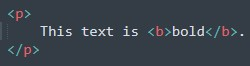
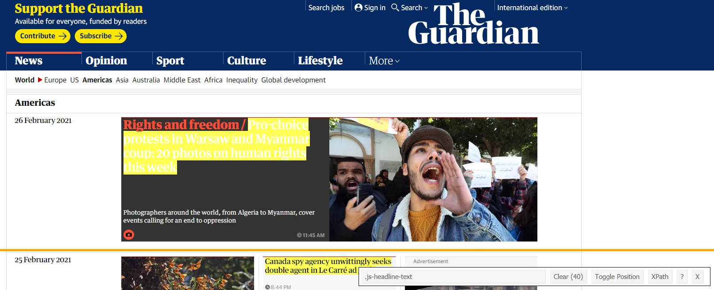
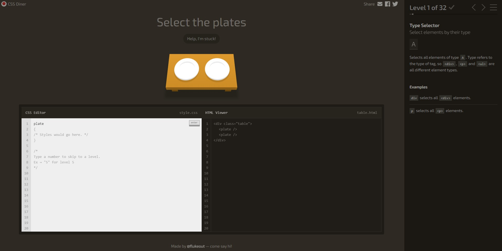
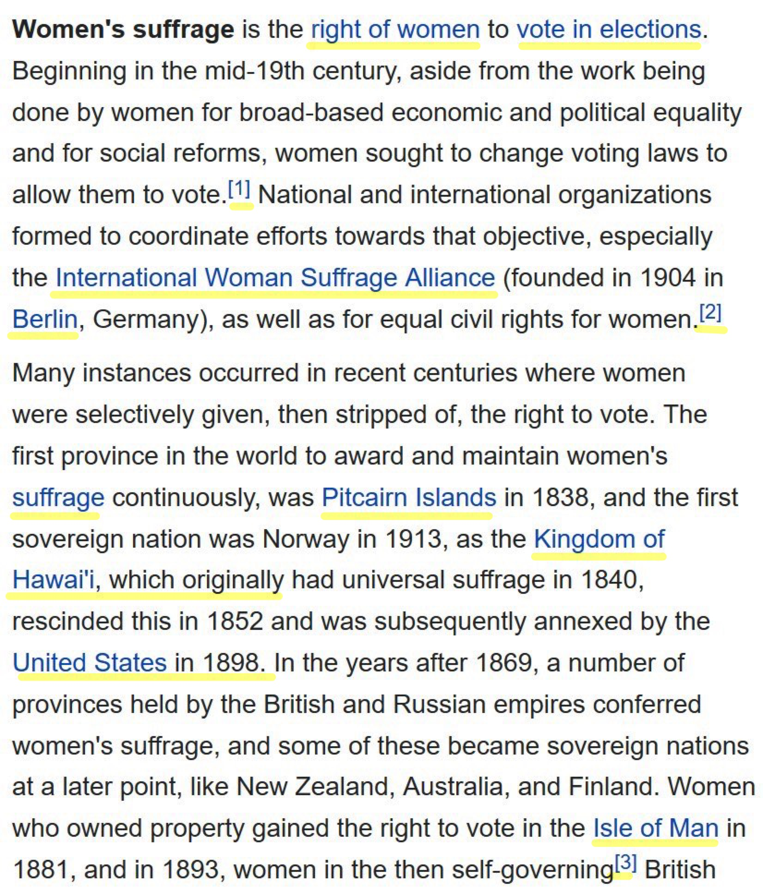
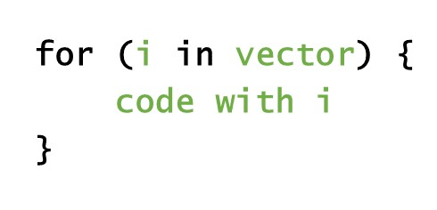
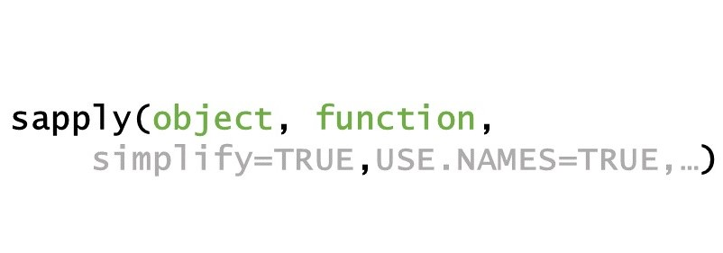

layout: true

<div class="my-footer">
  <span style="text-align:center">
    <span>
      
    </span>
      <a href = "https://github.com/ibantel/2021-03-05_CEU_Webscraping-with-R">
        <span style="padding-left:82px">
          <font color="#7E7E7E">Ivo Bantel (UZH / CIS)</font>
        </span>
        <font color="#7E7E7E">Collecting web data with R | March 5, 2021</font>
      </a>
</div> 

<style>
p.large {
    font-size: 15px;
    background-color: tomato;
}
</style>

---

<br><br><br><br><br>
## While you wait...

... please ensure you installed all necessary packages

<br>
.pull-right95[
```{r, echo = T, eval = FALSE}
install.packages(c("rvest", "tidyverse", "knitr", "rmarkdown", "xml2"))
```
]

???

- Please make sure you have installed all packages
- if you run into problems, please try restarting RStudio and trying again. 
- If you still have problems, we'll have to figure that out prior to the first exercise


- also, please turn on cameras :) 


---
```{r setup, include=FALSE}
options(htmltools.dir.version = FALSE)
# see: https://github.com/yihui/xaringan
# install.packages("xaringan")
# see: 
# https://github.com/yihui/xaringan/wiki
# https://github.com/gnab/remark/wiki/Markdown
options(width=110)
options(digits = 4)
```

```{r setup (2), echo = FALSE ,message = FALSE, warning = FALSE}
knitr::opts_chunk$set(comment=NA, fig.width=6, fig.height=6, echo = TRUE, eval = TRUE, message = FALSE, warning = FALSE, fig.align = 'center', dpi = 200)
library(tidyverse)
```

.pull-left6[

<br><br><br><br><br>


## Goal


>### Introduce the fundamentals of web scraping, with hands-on experience!

]

.pull-right4[

<br><br><br><br>
<p align="center"></p>

]

???

- In this short workshop, I'm trying to 
- give you a first introduction to what web is,
- how you can do it, and 
- give you some hands-on experience

---

<br>
## Schedule 

.pull-left[<br<br><br> <br><br><br><br>]

<ul>
    <li style="font-size: 30px">Background scraping</li><br>
    <ul class="level">
        <li style="font-size: 22px">why you should (not) scrape</li><br>
        <li style="font-size: 22px">varieties of scraping</li><br>
        <li style="font-size: 22px">HTML</li><br><br>
    </ul>
    <li style="font-size: 30px">Exercises web scraping</li><br>
</ul> 

???

- In the next hour or so,
- I'll first introduce scraping and what to consider when doing it
- then I'll talk on different varieties of scraping and
- the basics of HTML and CSS selectors
- We'll then take a little break and in the second part, we'll practise web scraping,
    - we'll extract content from web pages using CSS selector and
    - scrape tables
- if we have time in the end, I'll also say a few words about scaling up and scraping several pages (e.g. with loops and functions)

- for these exercises, you will be in smaller breakout rooms to help each other where you can


---

<br>
## About me: Ivo Bantel
.pull-left65[


<br><br>
<ul>
  <li class="m1" style="font-size: 25px">PhD student (UZH, Digital Democracy Lab)</li><br><br>
  <li class="m2" style="font-size: 25px">_research interests_:</li>
    &#8239; &#8239; &#8239; &#8239; polarization, extreme right politics, political violence,<br>
    &#8239; &#8239; &#8239; &#8239; web scraping, quantitative text analysis<br><br><br>
  <!--- <li class="m2">_teaching_: webscraping, qualitative methods, substantive courses</li><br>--->
  <li class="m2" style="font-size: 25px">_Contact:_</li><br>
  &#8239; &#8239; &#8239; &#8239;
  <i class='fas fa-envelope' style='font-size:.9em;' ></i> &#8239; &#8239; &#8239; [bantel@ipz.uzh.ch](mailto:bantel@ipz.uzh.ch)
  <br> &#8239; &#8239; &#8239; &#8239;
  <i class='fab fa-twitter' style='font-size: .9em;'></i> &#8239; &#8239; &#8239; [@ivobantel](https://twitter.com/ivobantel) 
  <br>
<ul>
]

.pull-right25[
<a href='https://www.ipz.uzh.ch/en'> <br>
<a href='https://www.ipz.uzh.ch/en'>

<!--- https://fontmeme.com/name-tags/ --->

]

???

- To get started I want to introduce myself and then get to know some things about you
- I will introduce myself quickly. 
- I'm doing my PhD at the University of Zurich, and I'm also part of the Digital Democracy Lab, which is a research hub focusing on the implications of digital technology for politics and democracy using computational social science methods
- we also provide a research infrastructure that enables efficient, scalable, and replicable data collection and analysis for collaborators, so check that out if you're interested 

- my substantive research areas are polarization, extreme right politics, and terrorism (in that order) ;)
- and methodologically, I'm interested in computational methods of data collection and analysis, like web scraping and quantitative text analysis

---

<br>
## Getting to know you

???
- Due to the limited time, we won't be able to go around for everyone to introduce themselves unfortunately. So I will have to get to know you quantitatively - sorry for that! If you want to stick around for a drink later on, I'd be happy to chat for a bit.
But for now, I have some questions. Please use *Yes*, *No* etc. in Zoom.
- To get to know you, I'll ask a few questions and ask you to use the reactions buttons
- First question: "I have found the "open mouth" button".

--

<br>

- How much experience do you have with R? <br> 
  &nbsp;  &nbsp; None &nbsp;  &nbsp;  &nbsp;
  &nbsp;  &nbsp; Some  &nbsp;  &nbsp;  &nbsp;
  &nbsp;  &nbsp; I can write functions &nbsp;  &nbsp;  &nbsp;
  &nbsp;  &nbsp; I'm a pro


--

<br>

- Have you used `RMarkdown` notebooks before? <br> 
  &nbsp;  &nbsp; Don't know what that is &nbsp;  &nbsp;  &nbsp;
  &nbsp;  &nbsp; I've opened one  &nbsp;  &nbsp;  &nbsp;
  &nbsp;  &nbsp; I've written some &nbsp;  &nbsp;  &nbsp;
  &nbsp;  &nbsp; All the time

--

<br>

- Have you ever webscraped? <br>
  &nbsp;  &nbsp; What _is_ that? &nbsp; &nbsp;
  &nbsp;                  &nbsp; Never           &nbsp; &nbsp;
  &nbsp;                &nbsp; Once            &nbsp; &nbsp;
  &nbsp;            &nbsp; I could teach it

--
 

<br>

- How comfortable are you with HTML? <br>
  &nbsp;  &nbsp; HTwhat? &nbsp; &nbsp; &nbsp;
  &nbsp;                  &nbsp; Heard of it    &nbsp; &nbsp;
  &nbsp;                &nbsp; I know basics  &nbsp; &nbsp;
  &nbsp;            &nbsp; I'm fluent


<br>
 

<!--- - Is there a specific webpage you want to scrape? (Use chat) --->

---

class: inverse, center, middle
## Background scraping


???

- let's get started with the content then

- I will first give some background for everyone to understand how we can leverage `R` to automatically collect data from the web

- afterwards, we'll go through a few exercises

---

<br>
## Scraping &mdash; and why you...
<br>

???

- I'll now quickly talk about the advantages of scraping -- and its dangers.
- I won't be able to discuss this in detail but just want to make you aware of some considerations you should keep in mind

- I assume that you all have some idea -- maybe too optimistic -- about why web scraping helps
- but why should we scrape?

--

.pull-left45[

### &nbsp; &nbsp; &nbsp; ... should do it
<br> 

**Data availability**: <br>
&nbsp; &nbsp; &nbsp; increasing amount of...
- public data online ("open government")<br><br>
- politics happens online<br><br>
- people use the internet - and share everything online<br><br>
- data online makes real world phenomena more visible online 
] 


???

- In short, there are lots of data out there that is online that we can access (only or more easily with web scraping)
- This includes data from government sources, politics that happens online -- political actors using online platforms to e.g. perform political actions; not just since the pandemic; but this also includes individuals sharing a lot online
- in sum, all this data online makes real world phenomena more visible online

- okay, now that we know what the benefits are, why should we **not** scrape?
- as you might have thought from the list I just went through, there are also some drawbacks and limiting considerations
- We can only touch upon the legal and ethical questions here
- but i will highlight some points you need to be aware of


--

.pull-right45[
### &nbsp; &nbsp; &nbsp; ...should _not_ do it

<br> 

**Legal, ethical, and logistical barriers**

- criminal code, copyright laws etc. <br> &rarr; check `robots.txt`, use `polite` package<br><br>
- terms of service / measures to prevent scraping<br><br> <!--- (API restrictions, 'distributed Turing test') --->
- ethical regulations and considerations <!----(privacy, GDPR, informed consent)---->

] 

???

- the first thing to keep in mind is that you could actually break law when scraping; to prevent that, every page provides a file called robots.txt that tells you what you're not supposed to do on this site
- similarly, some sites have measures in place to prevent you from scraping because it's against their terms of service
- finally, ethical considerations: if you're scraping e.g. personal data, you need to be aware of privacy question and informed consent of your subjects!!! please take this seriously! web scraping is a powerful tool, use it wisely!


---

<br>
## Scraping: what is out there?

--

.pull-left45[

<br><b><font size=6 color = "000000">1. Scraping static pages</font></b></li>

]

.pull-right45[

  <a href = "https://www.theguardian.com/international">
    
  </a>
  <font size=1>Screenshot "The Guardian"</font>

]

???

- Scraping: extracting data from the web
 - includes anything from university webpage to social media
 - lots of different techniques

- types of scraping
 - structured vs. unstructured data
 - gathering as diverse information as possible from different pages vs. very specific scrapers
 - one-off scraping vs. regular data collection


1. Static pages (that is what we'll cover today)
- extracting text, links and tables from many standard webpages
    - page written in HTML / XML
    - page has a static URL through which you can reach it

Procedure
- 'parsing' page in R
- extracting relevant parts
- cleaning into usable format (e.g. data frame, raw text, ...)

---

<br>
## Scraping: what is out there?


.pull-left45[

<br><b><font size=6 color = "A0A0A0">1. Scraping static pages</font></b></li>
<br><br><br><br><font size=6 color = "000000">2. APIs <font size=4>(application programming interface)</font></font></li>

]

.pull-right45[

  <a href = "https://www.data.gov/developers/apis">
    
  </a>
  <font size=1>Screenshot "DATA.GOV"</font>

]

???

2. APIs

- companies and governments often provide **application programming interfaces** for their data
    - increasing accessibility, reliability
    - used for scraping and interaction with apps

- Differences to static pages
  - structured data in specific notation (often JSON)
  - access through sending requests, e.g. with `httr` package
  - in many cases: R packages for access to API, e.g. `gender`, `rtweet`, `WikipediR`, `tuber`, ...

- pro: 1) legal and robust to changes in webpage structure; 2) highly standardized
- con: 1) availability: not every page has API; 2) speed: rate limits / restrictions to amount of data; 3) may be terminated: ['post API age'](https://www.tandfonline.com/doi/full/10.1080/10584609.2018.1477506) 


---

<br>
## Scraping: what is out there?


.pull-left45[

<br><b><font size=6 color = "A0A0A0">1. Scraping static pages</font></b></li>
<br><br><br><br><font size=6 color = "A0A0A0">2. APIs <font size=4>(application programming interface)</font></font></li>
<br><br><br><br><font size=6 color = "000000">3. Dynamic pages</font></li>

]

.pull-right45[

  <br><br><br>
    
  <br>
  <font size=1>Screenshot "Netflix.com"</font>

]


???

3. dynamic pages
- for scraping pages that change while you are on them without changing their URL
    - e.g. Netflix, Buzzfeed, (many) search functions, pages without permanent URL

- Differences to static pages
  - simulates web browsing rather than parsing static page
  - scraping through commands to browser

- pro
    - get around many restrictions to scraping
    - possibility to automate browsing
- con
    - difficult to set up
    - less robust than static scraping
    - legal concerns

---

<br>
## Scraping: what is out there?


.pull-left45[

<br><b><font size=6 color = "A0A0A0">1. Scraping static pages</font></b>
<br><br><br><br><font size=6 color = "A0A0A0">2. APIs <font size=4>(application programming interface)</font></font></li>
<br><br><br><br><font size=6 color = "A0A0A0">3. Dynamic pages</font>
<br><br><br><br><font size=6 color = "000000">4. Web crawlers / spiders</font>

]

.pull-right45[

  <br>
    
  <br>
  <font size=0.1>&nbsp; &nbsp; &nbsp; &nbsp; &nbsp; &nbsp; &nbsp; &nbsp; &nbsp; &nbsp; &nbsp; &nbsp; &nbsp; &nbsp; &nbsp; &nbsp; &nbsp; &nbsp; &nbsp; &nbsp; &nbsp; &nbsp; &nbsp; &nbsp; &nbsp; &nbsp; &nbsp; &nbsp; &nbsp; &nbsp; &nbsp; &nbsp; &nbsp; &nbsp; &nbsp; &nbsp; Created by Symbolon from the Noun Project</font>

]

???

4. web crawling / spiders

- parsing of massive amounts of data
    - e.g. price data, building a search engine, ...
- reading of pages as usual but parsing e.g. through `boilerpipeR`

- Differences to static pages
  - no selection of specific parts but use of *heuristics* on HTML code
      - &rarr; less exact but less labor-intensive extraction of content
  - pro
    - masses of data
  - con
    - masses of data (that are unclear)

- **are there any questions?**

---

class: inverse, center, middle 
## HTML


???

before we can dive into the exercises, we need to get some understandingof HTML

- refers to **H**yper **T**ext **M**arkup **L**anguage
  - *markup*: additional description of formatting beyond the content of the text
  
  - let's consider an example

---

<br>
## HTML 101: example

<br> 


.pull-left45[

### turning this... 
  <br>
    
  <br>
  <font size=0.1>&nbsp; &nbsp; &nbsp; &nbsp; &nbsp; &nbsp; &nbsp; &nbsp; &nbsp; &nbsp; &nbsp; &nbsp; &nbsp; &nbsp; &nbsp; &nbsp; &nbsp; &nbsp; &nbsp; &nbsp; &nbsp; &nbsp; &nbsp; &nbsp; &nbsp; &nbsp; &nbsp; &nbsp; &nbsp; &nbsp; &nbsp; &nbsp; &nbsp; &nbsp; &nbsp; &nbsp; Screenshot sourcecode [quotes.toscrape.com](http://quotes.toscrape.com/).</font>
  
]


--

.pull-right45[

### ...into this
  <br><br><br>
    
  <br>
  <font size=0.1>&nbsp; &nbsp; &nbsp; &nbsp; &nbsp; &nbsp; &nbsp; &nbsp; &nbsp; &nbsp; &nbsp; &nbsp; &nbsp; &nbsp; &nbsp; &nbsp; &nbsp; &nbsp; &nbsp; &nbsp; &nbsp; &nbsp; &nbsp; &nbsp; &nbsp; &nbsp; &nbsp; &nbsp; &nbsp; &nbsp; &nbsp; &nbsp; &nbsp; &nbsp; &nbsp; &nbsp; Screenshot [quotes.toscrape.com](http://quotes.toscrape.com/).</font>

]

???
HTML turns this code ...

 ... into this (more or less) beautiful home page

---

<br>
## HTML 101: components

???

- let's take a step back and look at some HTML

--

.pull-right45[<br><br><br><br><br>]


???

- Let's look at some HTML text.
- if we type this into a code editor and specify that this is a HTML document, the syntax highlighting will look similar to this
- we can see here that there are two components: white text and colored text

--

<br>

.pull-left55[ <br>

1. **HTML elements** (e.g. text, images)<br><br>

2. **HTML tags**<br><br>

  - specify elements' _character_ or _behaviour_<br><br>

  - usually start & end tag <br> &nbsp; (exceptions: images, line breaks, ...)<br><br>

  - surround the element they modify
<br>

]


???

- these are the two components of HTML: html elements and html tags

- we want to scrape the text (we could also scrape embedded images, e.g. for visual analysis etc.)
- but to _get_ the text, we need to access the parts we cant using the tags

--

<br>

.pull-right45[<br>
Example: <br><br>

&nbsp; &nbsp; &nbsp; &nbsp; `<tagname>` <br>
&nbsp; &nbsp; &nbsp; &nbsp;&nbsp;&nbsp;  &nbsp;  &nbsp; `Some content here...` <br>
&nbsp; &nbsp; &nbsp; &nbsp; `</tagname> `]

???

- To make a generic example, this would be something like this


---

<br>
## HTML tags: basics

.pull-right85[
<br><br>
``` 
<html> 
    <head> 
        <title>Title of your web page</title> 
    </head> 
    <body> 
      <h1>Heading</h1>
      <p>HTML web page content</p>
    </body> 
</html> 
```
]

???
- let's look at an example -- hich tags can you see here?

- we are mostly interested in what is inside the **body**, that is, the content of a webpage
- **head** gives meta information, often used by search engines; we tend to ignore it
- as we see in the `<h1>` part, tags can be **nested**

---

<br>
## HTML tags: headings & paragraphs

<br><br>

<ol>
<li>Headings (defined by numbered h tags):</li>

`<h1>my heading</h1>` &nbsp;&nbsp;&nbsp;&nbsp;&nbsp;&nbsp;&nbsp;&nbsp;&nbsp;&nbsp;&nbsp;&nbsp;&nbsp;&nbsp;&nbsp;&nbsp;&nbsp;&nbsp;&nbsp;&nbsp;&nbsp;&nbsp;&nbsp;&nbsp;&nbsp;&nbsp;&nbsp;&nbsp; <font size=12>my heading</font>

`<h2>a smaller heading</h2>` &nbsp;&nbsp;&nbsp;&nbsp;&nbsp;&nbsp;&nbsp;&nbsp;&nbsp;&nbsp;&nbsp;&nbsp; <font size=6>a smaller heading</font>

--

<br><br>
<li>Paragraphs are defined by "div" or "p" tags</li>

`<p>this is a paragraph.</p><div>and this is the next.</div>`
<p>this is a paragraph.</p><div>and this is the next.</div>


---

<br>
## HTML tags: attributes

.pull-right75[`<tagname attribute="x"> Some text here </tagname>`]

<br>

--
<br>
**Links and attributes**


.pull-left45[
`<a href="http://theguardian.co.uk"> Link</a> to theguardian.co.uk` 

<br><br><br><br>

&nbsp;&nbsp;&nbsp;&nbsp;&nbsp;&nbsp;&nbsp;&nbsp;&nbsp;&nbsp;<a href="http://theguardian.co.uk">Link</a> to theguardian.co.uk
]

.pull-right55[

  
  ` &nbsp;&nbsp;&nbsp;&nbsp;&nbsp;`alt="My cat" width="400">`
  
  
  
  .pull-right85[<br>]
  

]

???
- All HTML elements can have attributes
- Attributes provide additional information about an element
    - they are included inside the starting tag
    - they usually come in name and value pairs
- examples are the source of an image, its width, the target of a hyperlink, etc.
    
Tags can have attributes -- the most common case of attributes are **links**
- text or images turned into a link by surrounding `<a>` tag (*anchor*)
- link address specified as href attribute (*hyperreference*)

- other examples of attributes
  - alt: descriptions, e.g. for images
      - for users with visual impairments, when image is missing
  - src: source file `  `
  - style: text styling (e.g. color ` <p style="color:red">This is a paragraph.</p> `)

- how many attributes do we have for each? which ones?

---

<br>
## HTML tags: Classes


<br>

### General example

.pull-left75[<br>

`<div class="container">This is the text</div> `

]

.pull-right25[<br><div class="container"> This is the text</div>

]

<br>

???

- **Classes** are another special case of attributes that is used for formatting 
    - for our purposes, classes styles that are specified before
    - classes are used within tags
    
- what is the name of the class here?

--

### Styling with Classes

.pull-left65[<br>

```
<style>
    p.error {color: red;   border: 1px solid red;} 
</style>

    <p class="error" align="left">Red highlight</p>
```
]

.pull-right35[ 
<br><br><br>

<style>
p.error {
  color: red; border: 1px solid red;
} 
</style>
<p class="error">Red highlight</p>

]

???
    
- don't worry if you don't understand everything
  - you should understand the logic: 
  - the stuff in the *greater than* and *less than* signs **TAGS** isn't printed but can tell us what role the text plays in the home page. 
  - the stuff also includes **attributes** that modify how it looks

---

<br>
## HTML tags: Practicalities


???

- In daily life, I use the CSS selectorgadget

--

.pull-right95[



To easily access selectors, use Chrome [selector gadget](https://chrome.google.com/webstore/detail/selectorgadget/mhjhnkcfbdhnjickkkdbjoemdmbfginb).]

???
- it's available in google chrome and allows you to click on an element; 
- all elements of the same attributes are then highlighted and can be deselected
- this way, you can use point & click to select only the elements you want

---

<br>
## Practicing with the [CSS Diner](https://flukeout.github.io)
<br>

.pull-right85[

]

???
- the **CSS Diner** allows practising, 
- [@Ivo] go to the page
- the first (of 32) level is solved like this; hovering over the elements let's you know how each is called; the moving ones should be selected
- the right column explains details to you
- Now @everyone, go to the page flukeout.github.io and practise for 5min

---

class: inverse, center, middle
## Let's start scraping in R

???

- I know this has been quite a bit of background; 
- but I hope that now you have a bit of an idea what and how we could collect data from the web
- so: let's start scraping 
- the good think in `R` is: no matter what you're trying to do - there's always a package for it
- so let's get started using a simple example and the package `rvest`
(- now use the rmarkdown file)

---

<br> 
## `rvest`

<br><br>

.pull-left35[
&nbsp;&nbsp;&nbsp;&nbsp;&nbsp;
]

???

- `rvest` is an `R` package for scraping, 
- it's a wrapper around some other packages that is part of and integrates well with the tidyverse universe
- it is like the Swiss army knife of scraping: very versatile, widely applicable and rather intuitive to use

- it's strengths and weaknesses are also similar to that of the Swiss army knife:
    - [+] covers most frequent use cases and
    - [+] integrates with other packages, e.g. tidyverse very well; **but**
    - [-] it is also relatively simple: no dynamic webpages

- its main uses are 
  - getting tables, 
  - getting text, and
  - extracting links from home pages - and that's what we'll focus on today
  <!--- (and downloading files) --->

--


.pull-right55[<br><br>

### Main commands:
- `read_html()`
- `html_nodes()` / `html_node()`
- `html_text()`
- `html_table()`
- `html_attrs()` / `html_attr()`
]
???
The main functions of rvest are:
- `read_html()` - reads in an HTML page
- `html_nodes()` / `html_node()` - select nodes from an HTML document (i.e. extract pieces using selectors)
- `html_text()` - extracts the attributes, text, and the tag name from an html
- `html_table()` - parses an html table into a data frame
- `html_attrs()` / `html_attr()` - extracts attributes, text, and tag name from an html, e.g. the link text

---

<br>
## Scraping manually

<br><br>

.pull-left25[

- Specify resource

<br>

- Read ("parse") resource

<br>

- select elements
]

.pull-right75[
``` {r echo=T, eval=F}
url_quotes <- "http://quotes.toscrape.com" 
# call browseURL(url_quotes) to inspect page
```


``` {r echo=T, eval=F}
library(rvest)
page_quotes <- url_quotes %>% read_html()
```

<br>

``` {r echo=T, eval=F}
page_quotes %>% html_text() # removes tags & formatting

page_quotes %>% html_nodes("a") # extract links 
    # <a href="...">LINK TEXT 1</a>
    # <a href="...">LINK TEXT 2</a>

```
]

???
scraping with R works in a specific way:
1. you manually specify a resource
2. then you instruct R to send a request to server that hosts website, and the server returns the requested resource
4. R parses the returned HTML (i.e., interprets the structure); BUT: R does not render the HTML in a nice fashion
5. you tell R which parts of the structure to focus on and what to extract

- how would we get only the TEXT of the links, not the links themselves (i.e. the <a href="...">LINK TEXT</a>)

---

class: inverse, center, middle 
## Let's practise
<br> &rarr; Exercises in `worksheet.Rmd`

???
- ok, this is the end of the input
- We now practice with the worksheet. If you haven't done so, you can download it from the GitHub page
- I will put you into breakout rooms of 4-5 people; if you're stuck, ask around - and if you cannot figure it out together, and have searched for a solution online, use the "ask for help" function.
- If I'm not coming immediately, I'm with another group. then please be patient and try again some minutes later

- [if applicable] if we have more time, I will provide some extra information (about links and automation)

- please be back in the main room around 5:40, so we can quickly discuss remaining questions and then say goodbye; if you then want to stick around for virtual drinks, I have prepared a room.
---

class:inverse, middle, center
## Thank you

Click [here](https://www.wonder.me/r?id=195ebb26-39f5-410a-a67a-82c0e67ff532) to enter the wonder-room (password: "Alohomora!")

???
If we have more time, I will provide some more infos (and I have two extras)

But if this is not the case, this is the end.


---

<br>
## The process of scraping


---

<br>
## The process of scraping


---

<br>
## The process of scraping


---

class: inverse, center, middle
## Extra (1): extracting links from webpages

---

<br>
## Links

.pull-left45[&nbsp;&nbsp;&nbsp;&nbsp;&nbsp; ]

???

- unlike a book that we read cover to cover,  webpages distribute information over multiple pages
- *hyperlinks* connect one page to the others &rarr; we follow them by clicking
    - we need to deal with this differently when scraping
    
- We discussed links as a common case of attributes
    - content turned into a link with `<a>` tag (*anchor*)
    - link address specified as href attribute (*hyperreference*)
  
--

.pull-right45[
### Extracting links with rvest
<br><br>
- link text:
    <br>&nbsp; `html_nodes(page, "a") %>%` <br> &nbsp; &nbsp; &nbsp; &nbsp; &nbsp; `html_text()` <br><br>
    
- hyperreference:
  <br>&nbsp; `html_nodes(page, "a") %>%` <br> &nbsp; &nbsp; &nbsp; &nbsp; &nbsp; `html_attr("href")`

]

???

*Caution*: Link is attribute of `<a>`-Tag! So we will have to select the _link nodes_ (a) and then get the href _attributes_

`html_attr(page,"href")` vs. `html_nodes(page,"a") %>% html_attr("href")`

---

class: inverse, center, middle
## Extra (2): scaling up

???

Just to give an outlook, we'll quickly discuss ways to scale up scraping

---

<br>
## Scaling up

???
- to scale up, we have two main ways of repeating code across different units

--

.pull-right75[



<br>




]

???
- Our two options are (1) for-loops and (2) variants of the apply function
- we'll focus here on loops, 

Advantages
- their main advantage is that they're easy to write
- do not require full translation of code into functions
- easy to interrupt and continue for prolonged scraping

Disadvantages
- become inefficient for high numbers of iterations
- no swag: [stackoverflow: Are For loops evil in R?](https://stackoverflow.com/questions/30240573/are-for-loops-evil-in-r)

Good to know
- loops with `for` are just the most well-known type of loop
    - `while` loops
    - `repeat` loops
    - `break` and `next` clauses

---

<br>
## `for`- loops: application

.pull-left45[
<br><br><br>
### Example

```{r,eval=F,echo=T}
for (i in 1:length(urls)){
  text[i] <- read_html(urls[i]) %>% 
    html_nodes(".text") %>% 
    html_text()
}
```

]

???
- We see here how we could employ a loop to extract a lot of text from some subpages in just a few lines of code
- imagine that `urls` is a vector of URLs that you scraped using the method to extract links that I showed before
- now you can easily just go through all subpages (to which you have the reference) and get any element from them that you want